# Empty Thoughts
[Empty Thoughts](https://empty-thoughts-071e97396088.herokuapp.com/) is a platform where you can freely express and share those fleeting thoughts that occur late at night before falling asleep, in the shower, or during that long daily commute.
Many of these daily thoughts go unused or unspoken, yet they often hold a certain charm and potential.
Empty Thoughts provides you with a canvas to voice these ideas, whether it's a profound insight, a small giggle-worthy joke or simply an empty thought.

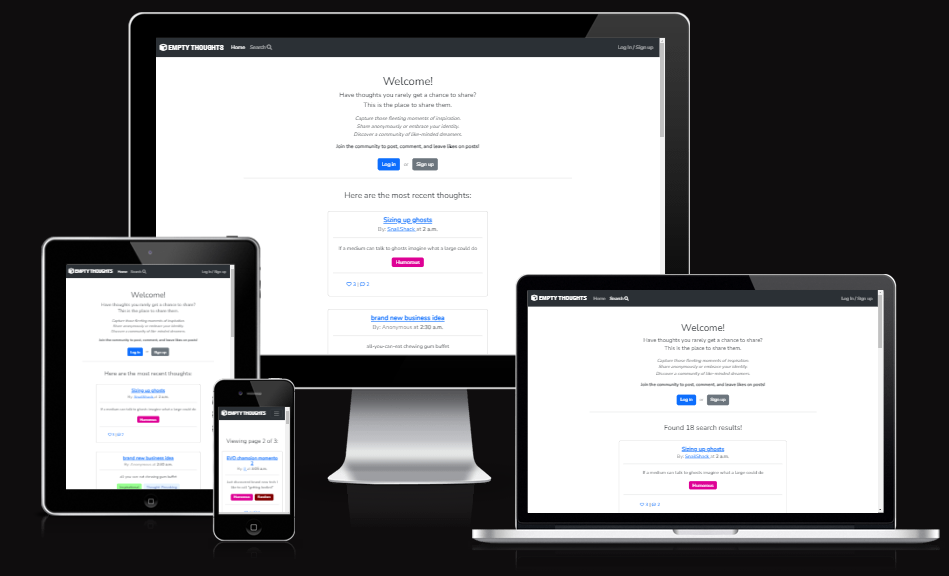

## Table of Contents
+ [UX](#ux)
  + [User Demographic](#user-demographic)
  + [User Stories](#user-stories)
+ [Design](#design)
  + [Colour Scheme](#colour-scheme)
  + [Typography](#typography)
+ [Wireframes](#wireframes)
+ [Database Schema](#database-schema)
+ [Features](#features)
  + [Existing Features](#existing-features)
  + [Future Features](#future-features)
+ [Testing](#testing)
  + [Manual Testing](#manual-testing)
  + [Automated Testing](#automated-testing)
  + [Discovered Bugs](#discovered-bugs)
  + [Validator Testing](#validator-testing)
  + [Unfixed Bugs](#unfixed-bugs)
+ [Technologies Used](#technologies-used)
+ [Deployment](#deployment)
+ [Credits](#credits)

## UX

### User Demographic

Empty Thoughts was built to give a voice to unspoken ideas and untapped ideas that otherwise would have been lost to time.
Meant for anyone with the capacity to dream but lacking a creative outlet, think of it as a chaotic collective diary where drifting thoughts can find a home.
With the freedom to post anonymously, even the extraordinarily silly or embarrassing can be shared without fear.

### User Stories

Project board can be found [here](https://github.com/users/AndreeeasN/projects/1)

#### As a visitor
  - I can login to an account so I can view/post/like thoughts
  - I can view a list of posts so I can read interesting thoughts
  - I can leave comments so I can interact with those sharing similar interests/thoughts
  - I can like/unlike individual posts/comments so I can show which ones I enjoy
  - I can search by category/author/tags so I can find thoughts relevant to my interests
  - I can mark my posts as anonymous so I can post private thoughts without fear of judgement

#### As an admin
  - I can edit/delete posts so that I can moderate the website
  - I can manage tags so I can adjust for future content
  - I can sort through the admin menu so I can quickly find what I'm looking for

## Design

### Colour Scheme:
As the tags attached to posts showcase a plethora of colors the rest of the page has been given a mostly monochrome look as to not make the vibrant colors overbearing.
Both the header and footer are a darker shade of gray with white text, while the rest of the page is plain white with black text providing ample contrast.
Clickable links such as thought titles or authors are in the traditional hyperlink blue as to promote intuitive user interaction.

### Typography:
The following fonts were obtained from the Google Fonts Library:
- 'Roboto Condensed' - used for the Header logo
- 'Nunito Sans' - used for the navbar and all other site content

## Wireframes
- Home page<br>
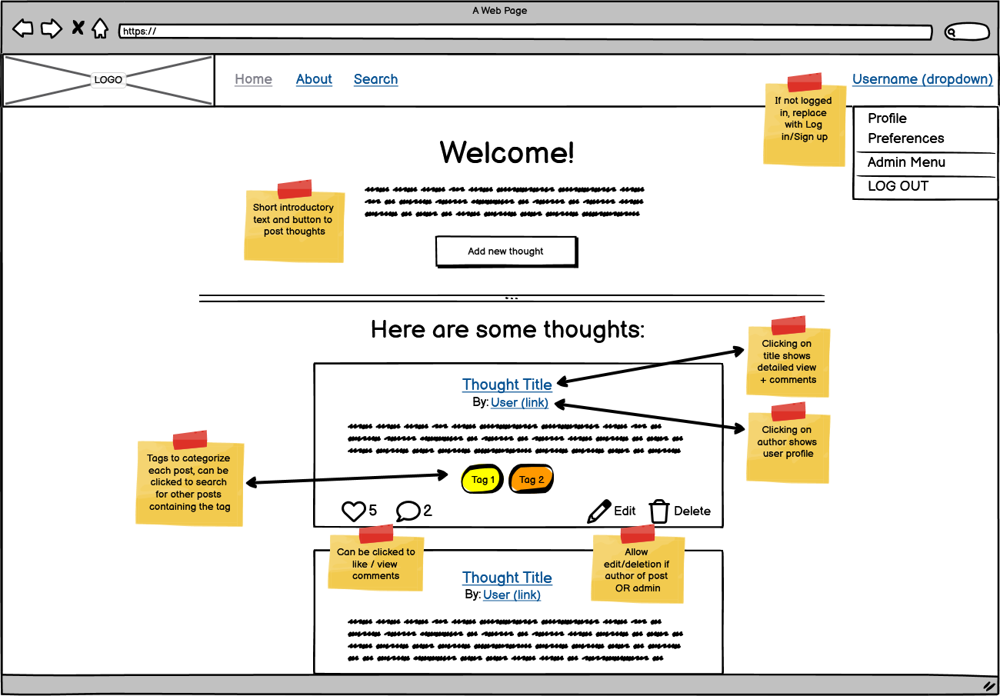
- About page<br>
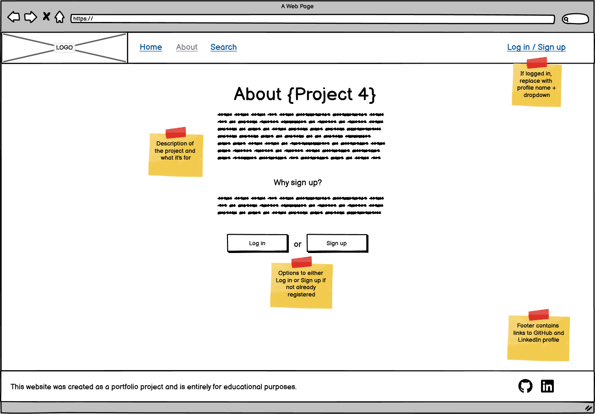
- Search page<br>
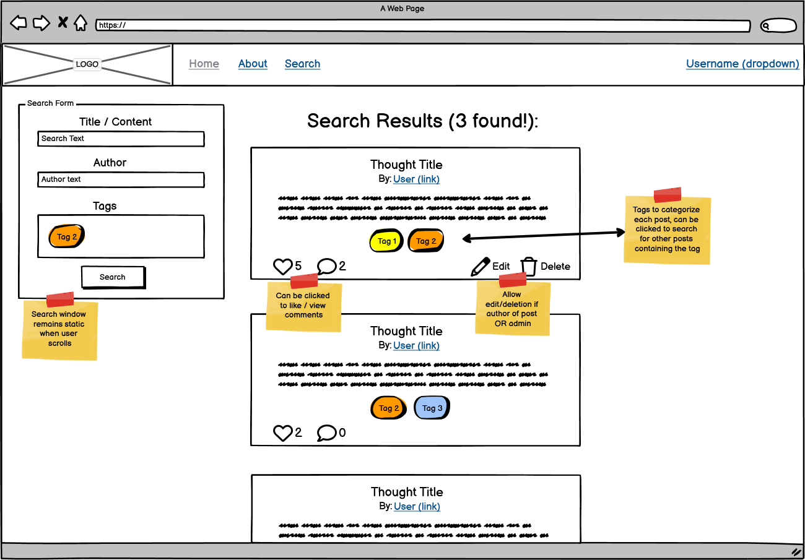
- Thought Details page<br>
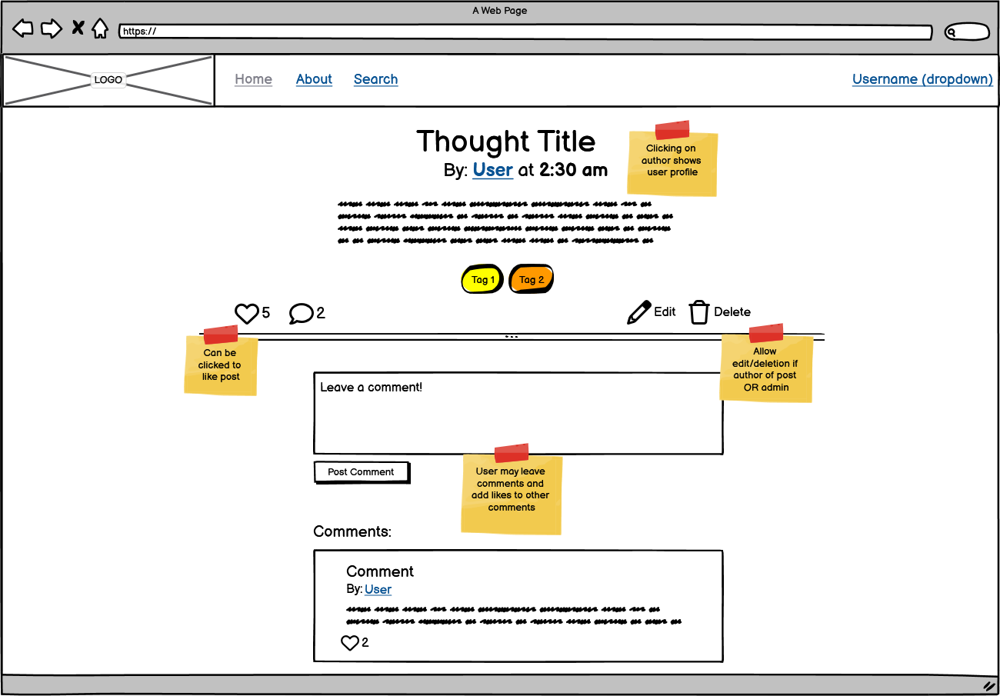
- User Details page<br>
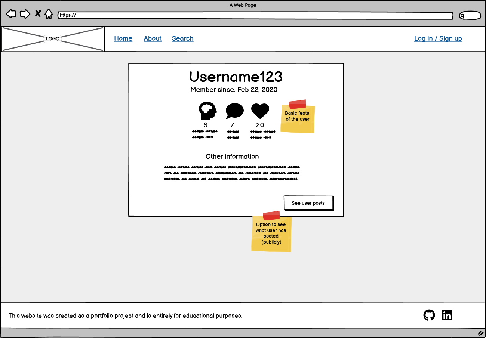

- As users are unlikely to visit the 'About' page a second time around and the 'Search' page was simply too similar to the Home page, these two pages both ended up being merged into the Home page during development. 

## Database Schema

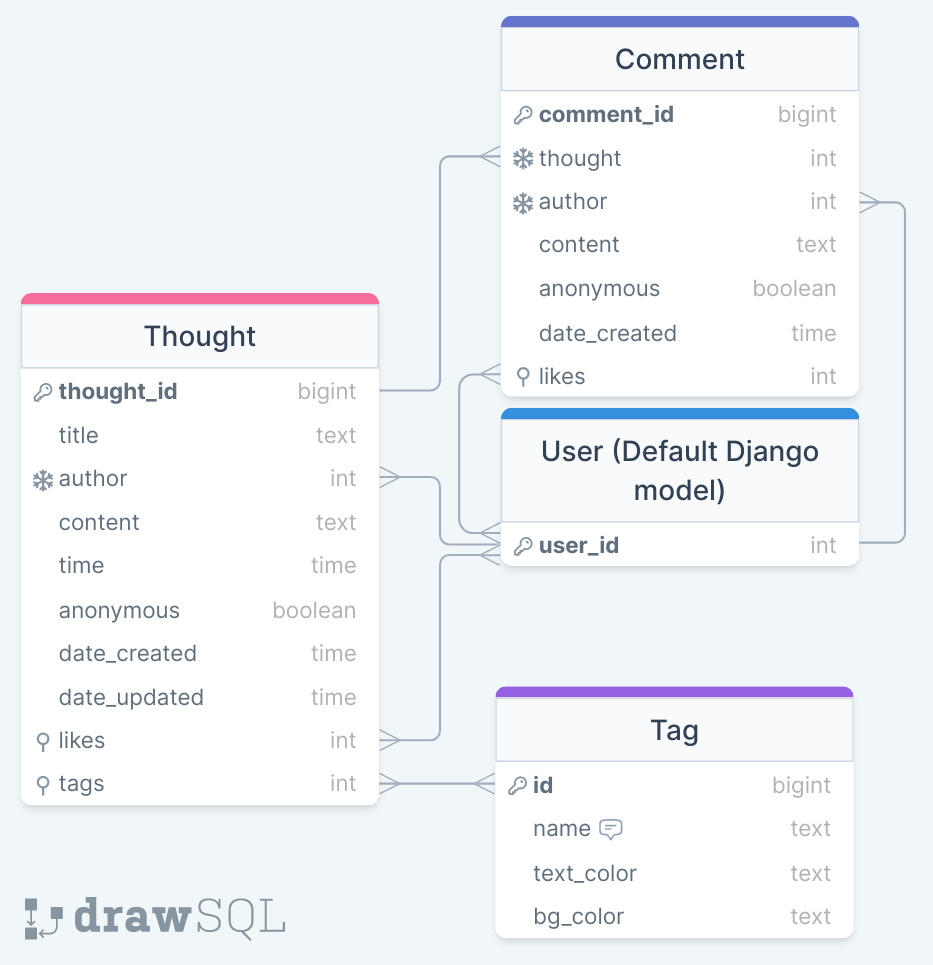

## Features

### Existing Features

#### Navigation
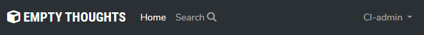<br>
- Header logo
  - Brings user to the home page on click
- Home
  - Same functionality as clicking on the header, brings user to home page
  - Is highlighted as active while on the home page, turns inactive when searching for posts or while on a different page
- Search
  - The 'Search' button in the navigation bar opens up a sidebar where the user can search for posts by their title, content, author and tags.<br>
  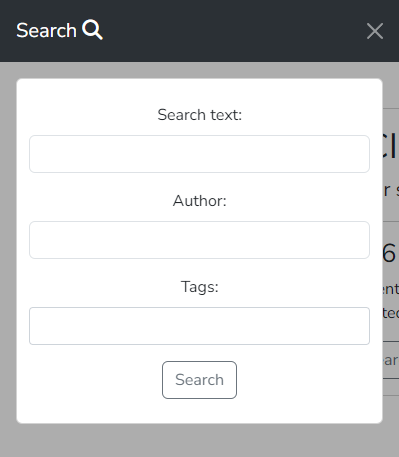
  - The search function is accessible from all pages, and the search results are displayed on the home page.
  - During a search the 'Search' navbar element will be highlighted as active
- Log in / Sign up<br>
  
  - When not logged in displays a link to log in or sign up
- Profile Name<br>
  
  - When logged in displays a dropdown menu where your user profile and log out button can be found
  - If logged in as a superuser the Admin Menu can be reached from here as well

#### Main Page
- About
  - On first visit the user will be presented with a short introduction to the website and the options to log in / sign up.<br>
  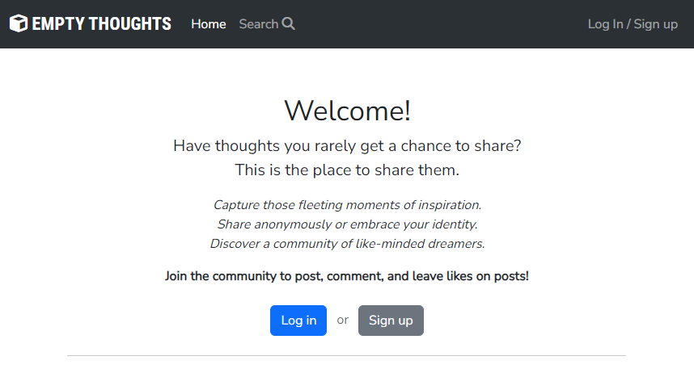
  - Once logged in this will be replaced with a simple hello, 'create thought' button and suggestion for the user to share whatever is on their mind.<br>
  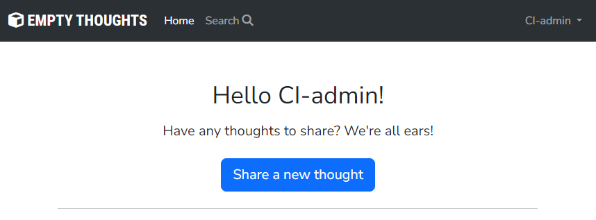
- Thoughts<br>
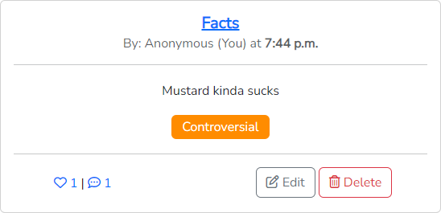
  - Can be liked by clicking on the heart icon, comments can be read by clicking on the comment icon or title of the thought.
  - If the author chooses to post anonymously their name will be shown as 'Anonymous'.
  - If submitted with a time entered, it will appear next to the author name.
  - If the user is the owner of a post '(You)' will be added to the author name, and buttons to edit or delete the post will be visible.
  - On attempting to delete the post, a confirmation window will be displayed before final deletion.<br>
  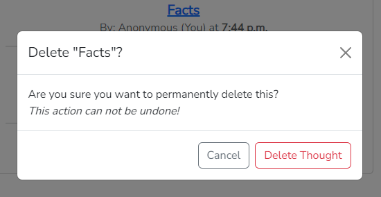

- Tags
  - Tags are pre-made are used to categorize posts and can be searched for using the search function.
  - Clicking on a tag will automatically start a search using that tag to find similar content.<br>
  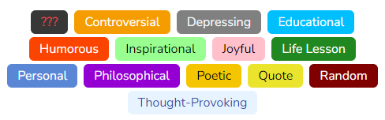
  - Admins can freely change text and background color from the admin menu.

- Pagination
  - To ensure consistant performance, user-submitted content has been split into pages as to not load everything at once.<br>
  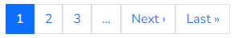
  - Page selection allows the following:
    - Jump one page forward / back
    - Jump to the first / last page
    - Jump to a page within 3 pages of the current one

#### User Account
- User Profile
  - Displays signup date and some basic feats of the user (Posts, comments, likes)
  - Also provides the option to search for all of their public posts<br>
  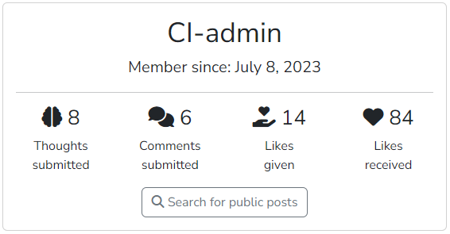
- Sign in<br>
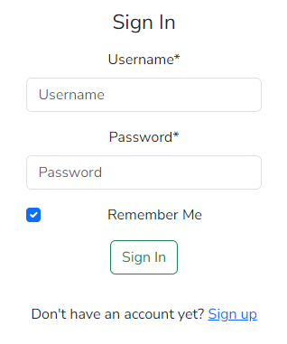
- Sign up<br>
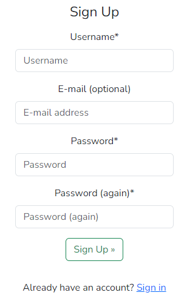
- Sign out<br>
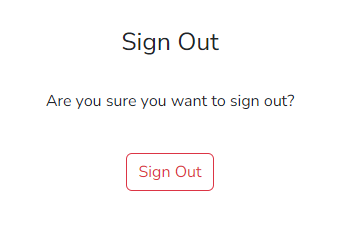

#### Thought Detail Page
A larger view of specific thought, has exact same functionality as when viewed from the home page. <br>
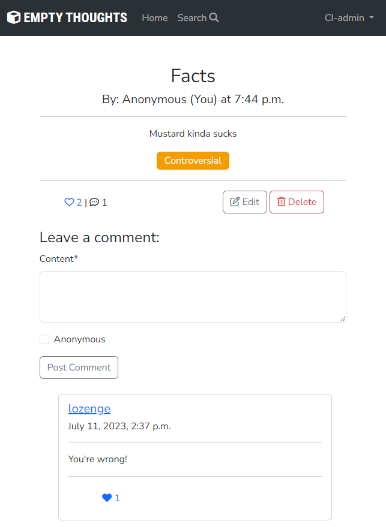
- Comment form
  - A simple text input with the option to post anonymously.
- Comments
  - Comments can be liked by clicking the heart icon, similar to liking a posted thought.
  - Can be deleted by the owner of the comment or a superuser.

### Future Features
- Password resets
- User site preferences (Dark mode, Search results per page, etc.)
- Customizing user profile
- Commenting on user profiles

## Testing

Normally Django will use a connection to a temporary postgres database to avoid running queries against the production database when running automated tests, the free tier of elephantSQL does however not allow more than one database. 
Due to this, tests have been carried out manually for each new feature introduced.

### Manual Testing

#### 1. Navbar
  - Responsiveness
    - Resizes well down to a minimum screen width of 320px
  - Website logo
    - Redirects to the front page as intended.
  - 'Home' Button
    - Redirects to the front page as intended.
    - Is correctly marked as active when not searching for posts.
  - 'Search' Button
    - Opens up the sidebar featuring the search form as intended.
    - Correctly marked as active during a user search, this includes navigating to the next page of search results or when returning no search results.
    - The Search sidebar retains functionality across all other pages as intended.
  - 'Log in / Sign up' 
    - Redirects to the login page as intended.
    - Visible only when not logged in as intended.
    - Link is correctly replaced with the User dropdown menu when logged in.
  - User Dropdown menu
    - Displays currently logged in User's username as intended.
    - Correctly hides 'Admin Menu' link when not logged in as a superuser
    - 'Log out' redirects to Sign out page as intented

#### 2. Front page
  - Responsiveness
    - Resizes well down to a minimum screen width of 320px
    - On smaller screen sizes the pagination bar will wrap around if many pages are available
  - About section
    - When logged out:
      - Displays 'About' message as intended
      - 'Log in' button redirects to login page as intended
      - 'Sign up' button redirects to signup page as intended
    - When logged in:
      - Displays welcome message as intended
      - 'Share new thought' button correctly redirects to 'Add new thought' page
    - Thought List
      - Thoughts
        - See [Thoughts](#testing-thoughts)
      - Correctly displays a maximum of 8 thought per page
    - Pagination
      - Enumerated page selector
        - Correctly displays and highlights the current page
        - Correctly redirects to intended page number on click
      - 'Next' and 'Previous' buttons
        - Correctly jumps forward or back one page on click
        - Correctly hides if on the first / last page
      - 'First' and 'Last' buttons
        - Correctly jumps to the first / last available page on click
        - Correctly hides if on the first/last page

#### 3. Thoughts<a id="testing-thoughts"></a>
  - Thought Title
    - Redirects to the thought detail page as intended
  - Thought Author
    - Redirects to the author profile page as intended
    - Displays as 'Anonymous' if thought is marked as anonymous as intended
    - Displays Author name followed by '(You)' if owner of the post as intended
    - Correctly displays time of day if specified by user
  - Thought Tags
    - Starts a search using clicked tag as intended
  - Like / Comment count
    - Clicking the like icon correctly adds / removes a like from the post and updates the counter
    - Clicking the comment icon correctly redirects to the thought detail page as intended
  - 'Edit' button
    - Redirects to 'Edit thought' page as intended
    - Only visible if logged in user is the owner of the post or a superuser as intended
  - 'Delete' button
    - Opens up the delete modal as intended
  - 'Delete' modal
    - Correctly display title of selected thought
    - 'Cancel' and X buttons both cancel the deletion as intended
    - Delete button correctly display the type of object ie. 'Delete thought'
    - 'Delete Thought' button correctly redirects to delete url using thought id
    - Redirects to home page on deletion as intended

#### 4. Thought Details page
  - Responsiveness
    - Resizes well down to a minimum screen width of 320px
    - On smaller screen sizes the thought like/comment counters and edit/delete buttons will stack as to prevent overlap
  - Thought
    - See [Thoughts](#testing-thoughts)
  - Comment form
    - Correctly limits the user to the max length of the Comment model
    - The 'Anonymous' checkbox correctly marks the comment as anonymous upon posting
    - 'Post Comment' correctly submits the comment to the thought page
  - Comments
    - Comment Author
      - Redirects to the author profile page as intended
      - Displays as 'Anonymous' if marked as anonymous as intended
      - Displays Author name followed by '(You)' if user is owner of the post as intended
    - Comment Timestamp
      - Correctly displays submission date and time
    - Like count
      - Clicking the like icon correctly adds / removes a like from the post and updates the counter
    - 'Delete' button
      - Opens up the delete modal as intended
    - 'Delete' modal
      - Correctly displays title as 'Delete Comment?'
      - 'Cancel' and X buttons both cancel the deletion as intended
      - Delete button correctly display the type of object ie. 'Delete comment'
      - 'Delete comment' button correctly redirects to delete url using the comment id
      - Redirects to thought detail page on deletion as intended

#### 5. User Details Page
  - Responsiveness
    - Resizes well down to a minimum screen width of 320px
    - On smaller screen sizes the user feats will stack vertically as to maintain legibility
  - Username and Signup date
    - Correctly displays the specified author as a header
    - Correctly shows account creation date as a subheader
  - User Feats
    - Correctly displays Thoughts / Comments submitted and Likes given / received
  - 'Search for public posts' button
    - Redirects to search page using the Author's username as search field as intended

#### 6. 'Add new thought' page
  - Authorization
    - Correctly redirects user to login page if not logged in when entering page
    - Correctly redirects user to login page if attempting to submit after logging out in a separate tab
    - Redirects user to home page if logged in user is not superuser or owner of the post
  - 'Add thought' form
    - See [Thought Form](#testing-thought-form)
  - 'Submit Thought' button
    - Correctly submits thought form and creates new post without errors
    - Redirects to main page as intended

#### 7. 'Edit thought' page
  - Authorization
    - Correctly redirects user to login page if not logged in when entering page
    - Correctly redirects user to login page if attempting to submit after logging out in a separate tab
    - Redirects user to home page if logged in user is not superuser or owner of the post
  - 'Edit thought' form
    - Correctly auto-fills fields with pre-existing information 
    - See [Thought Form](#testing-thought-form)
  - 'Submit Thought' button
    - Correctly submits thought form and creates new post without errors
    - Redirects to main page as intended

#### 8. Thought Form <a id="testing-thought-form"></a>
  - Responsiveness
      - Resizes well down to a minimum screen width of 320px
      - On small-medium screen sizes the 'time' field will be given it's own row as to prevent overlap
  - Form
    - Correctly disallows user from submitting if 'Title' or 'Content' fields are empty
    - Time selection widget correctly opens on click
    - Tag selection
      - Tag selection widget opens correctly upon clicking 
      - Allows multiple selections as intended
      - Allows removing tags from selection as intended
  
#### 9. Sign up Page
  - Responsiveness
    - Resizes well down to a minimum screen width of 320px
  - Authorization
    - Redirects user to main page if already logged in
  - Sign up form
    - Correctly allows signing up both with or without entering an E-mail
    - Correctly disallows signing up under the following conditions:
      - Missing Username or Password
      - Password too short
      - Password too common
      - Password contains username
      - Repeated password doesn't match first password
  - 'Sign In' link
    - Correctly redirects to sign in page

#### 10. Sign in Page
  - Responsiveness
    - Resizes well down to a minimum screen width of 320px
  - Authorization
    - Redirects user to main page if already logged in
  - Sign in form
    - Correctly allows signing in using the corrects username and password
    - Correctly disallows submitting without a username or password
  - 'Sign Up' link
    - Correctly redirects to sign up page

#### 11. Sign out Page
  - Responsiveness
    - Resizes well down to a minimum screen width of 320px
  - Authorization
    - Redirects user to main page if already logged out
  - 'Sign Out' button
    - Correctly logs the user out
    - Redirects user to main page as intended

#### 12. 404 Page
  - Responsiveness
    - Resizes well down to a minimum screen width of 320px
  - 'Return Home' button
    - Correctly redirects user to main page

### Automated Testing
While automated tests have not been widely utilized in this project, some tests have been written to test the following functionality:
  - User can visit the home page
  - User can visit the 'Add Thoughts' page
  - User can open the 'Edit Thoughts' page using a thought id
  - User can create a new thought using the 'Add Thoughts' page
  - User can delete a pre-existing thought by using it's id 

### Discovered Bugs
- When viewing post details, the author(user) and logged in user would overlap in the context
  - This would end up displaying the author of the post as the user currently logged in which ended up difficult to notice during development before introducing a second account
  - Resolved by changing 'user' to 'author' in the view context to avoid conflicts

- When attempting to like another user's comment when logged in as a non-superuser you would be redirected to the login page with the message "Must be logged in to leave likes"
  - This was caused by a misplaced safety check, rather than checking if user was authenticated it would check if user was a superuser
  - Resolved by replacing the function user_is_owner_or_superuser with the function user_is_logged_in in the corresponding view

- When searching by multiple tags it could return duplicates if posts had multiple matching tags
  - Resolved by filtering posts by each tag individually (loop -> for tag in search)

- Setting the date of a model to current time using (models.DateField(auto_now_add=True)) would throw an exception
  - Resolved by changing it to (models.DateTimeField(default=timezone.now))

- Heroku not using cloudinary static files during development
  - Heroku attempts to serve static files by itself if debug is set to true in settings
  - Resolved by setting Debug=false in settings.py

- When checking for ownership of an object it would come back false if not a superuser
  - This was due to a faulty comparison in the function user_is_owner_or_superuser
  - Resolved by replacing (user is object_owner) with (user == object_owner)

- Refreshing a page after submitting a comment sent another identical comment
  - This was caused by the comment form context being included on refresh
  - Resolved by redirecting without the comment context upon succesfully submitting a comment

- In the admin menu, searching by author would throw an exception
  - This was due to 'author' in search_field returning a user object rather than a username
  - Resolved by changing 'author' in search_field to 'author__username' to return a username

- On deleting a comment the deletion modal would display "Delete null?"
  - This was due to the delete button missing a title attribute required by the JS handling the confirmation modal.
  - Resolved by adding the missing attribute data-delete-title to the delete button

### Validator Testing
- Html
  - All html pages pass through the [W3C Validator](https://validator.w3.org/) without issues
- CSS
  - CSS files pass through the [W3C jigsaw validator](https://jigsaw.w3.org/css-validator/) without errors<br>
  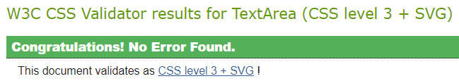
- JS
  - All JS files pass through the [JSHint Validator](https://jshint.com/) without issues
- Python
  - Python files pass through the [CI Python linter](https://pep8ci.herokuapp.com/) without issues
  - The exception being settings.py containing a few strings exceeding the suggested PEP8 length limit.
    - All but one are pre-made by django and as such have been left undisturbed
    - The one added line is ```STATICFILES_STORAGE = 'cloudinary_storage.[...]'``` which contains a longer string. As this string is a full link I've opted to not split it for both legibility and to avoid any potential errors.
- Lighthouse audit<br>
  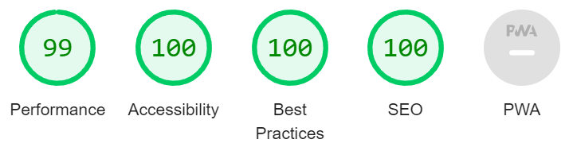
- The website has been tested to work in the following browsers:
  - Google Chrome
  - Mozilla Firefox
  - Microsoft Edge
  - Opera
- All external links open in a separate tab as intended.

### Unfixed Bugs

## Technologies Used

### Main Languages Used
- HTML5
- CSS3
- Javascript
- Python
- SQL - Postgres

### Frameworks, Libraries & Programs Used
- GitHub
- Visual Studio Code
- Django
- Bootstrap
- JQuery
- Font Awesome
- Google Fonts
- Balsamiq
- DrawSQL
- Paint.NET
- Favicon.io

### Installed Packages
- Django
- django-allauth
- psycopg2-binary
- gunicorn
- django-crispy-forms
- crispy-bootstrap5 
- django-colorfield 
- django-select2 
- django-filter
- django-bootstrap-datepicker-plus
- dj3-cloudinary-storage
- dj_database_url

## Deployment

### Heroku
The app was deployed to [Heroku](https://www.heroku.com/) using the following steps:

1. Ensure the following packages are installed to use Heroku, ElephantSQL and Cloudinary:
    - Django
    - gunicorn
    - dj_database_url
    - psycopg2
    - dj3-cloudinary-storage
2. Create a requirements.txt file using the following command
    - ```pip3 freeze --local > requirements.txt```
2. Create a new app from the [Heroku dashboard](https://dashboard.heroku.com/apps)
3. Select your heroku app from the menu and enter the 'Settings' tab
4. Click 'Reveal Config Vars'
5. Input all relevant key:value pairs
    - ```SECRET KEY : (Your secret key)```
    - ```PORT : 8000```
    - ```CLOUDINARY_URL : (Your Cloudinary API Environment variable)```
    - ```DATABASE_URL : (Your ElephantSQL postgres URL)```
6. Underneath, click 'Add Buildpack' and select the Python Buildpack
6. Add the following to your project settings.py:
    - ```ALLOWED_HOSTS = [(Your heroku app url), '127.0.0.1']```  (second address included for local testing)
    - ```STATICFILES_STORAGE = 'cloudinary_storage.storage.StaticHashedCloudinaryStorage'```
    - ```DATABASES = { 'default': dj_database_url.parse(os.environ.get('DATABASE_URL')) }```
7. Create a Procfile with the following line
    - ```web: gunicorn (YOUR_APP_NAME).wsgi:application```
8. Commit and push changes to GitHub
9. Go to your Heroku app and select the 'Deploy' tab
10. Select your deployment method, in our case we deployed through GitHub
11. From here you can either:
    - Deploy your project manually using the 'Deploy Branch' button.
    - Enable Automatic deploys to deploy everytime a new commit is pushed to the repository.
12. After a short time your app should be deployed and available from the 'Open App' button in the top right corner

## Credits
### Fonts used:
  - 'Roboto Condensed' by Christian Robertson
  - 'Nunito Sans' by Vernon Adams, Jacques Le Bailly, Manvel Shmavonyan and Alexei Vanyashin

### Code Snippets used:
  - [StackOverflow](https://stackoverflow.com/a/67526160) - Replacing part of url through templating by Mojtaba Arezoomand, used for paginating search results
  - [StackOverflow](https://stackoverflow.com/questions/30864011/display-only-some-of-the-page-numbers-by-django-pagination/46329564#46329564) - Enumerated pagination bar by Rob L, adapted to include 'jump to first/last' buttons

### Resources and tutorials used in developing this project:
  - [Code Institute](https://code-institute-students.github.io/deployment-docs/02-elephantsql/elephantsql-01-sign-up) - Setting up ElephantSQL
  - [Dan's Cheat Sheets](https://cheat.readthedocs.io/en/latest/django/filter.html) - Filtering and Pagination in Django by Dan Poirier
  - [Codu.co](https://www.codu.co/articles/securing-django-views-from-unauthorized-access-npyb3to_) - Securing Django views from unauthorized access by Daisy McGirr
  - [SimpleIsBetterThanComplex](https://simpleisbetterthancomplex.com/tutorial/2018/11/28/advanced-form-rendering-with-django-crispy-forms.html) - Advanced Form Rendering with Django Crispy by Vitor Freitas
  - [StackOverflow](https://stackoverflow.com/questions/46940623/how-to-do-i-automatically-set-the-user-field-to-current-user-in-django-modelform) - Automatically setting the author of a form 
  - [StackOverflow](https://stackoverflow.com/a/3930320) - Converting NoneType to int, used when calculating total user likes
  - [StackOverflow](https://stackoverflow.com/questions/71798874/django-how-to-add-or-condition-to-queryset-filter-in-custom-filter) - Combining multiple querysets in django
  - [StackOverflow](https://stackoverflow.com/questions/65157917/django-core-exceptions-fielderror-date-cannot-be-specified-for-forum-model-fo) - Setting datetime of models to current time on creation
  - [StackOverflow](https://stackoverflow.com/questions/5100539/django-csrf-check-failing-with-an-ajax-post-request) - Including CSRF token in Ajax post request
